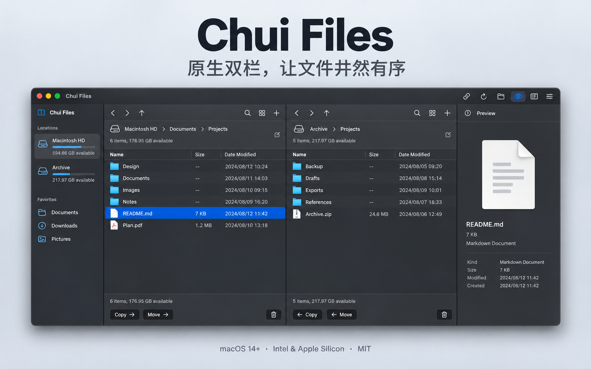

# Chui Files


一款面向本地文件整理的 macOS 原生双栏文件管理器。用左右两个目录完成查找、预览、复制、移动与差异同步，减少在多个 Finder 窗口之间来回切换。

**SwiftUI + AppKit · Intel / Apple Silicon 通用版 · macOS 14+ · MIT 开源**

[下载安装包](https://github.com/vctest23469-bot/chui-files/releases/latest) · [更新记录](CHANGELOG.md) · [反馈问题](https://github.com/vctest23469-bot/chui-files/issues) · [参与贡献](CONTRIBUTING.md)



*基于实际界面制作的 CG 展示图；目录与文件为演示数据，界面细节以当前应用为准。*

## 适合哪些工作

- **整理下载、文档和项目资料**：双栏、多标签、收藏、最近目录与可点击路径导航。
- **快速定位和确认文件**：输入停顿 0.3 秒自动搜索，结果直接显示在当前栏；支持文本内容搜索、Quick Look 和轻量文本编辑。
- **在磁盘间搬运资料**：显示当前项目的实际字节进度、平均速度与预计剩余时间，同名文件可跳过或保留两份。
- **比较两份目录**：先看差异、再勾选同步；支持排除规则与保存目录对预设。
- **了解存储情况**：挂载卷容量、已用比例与后台计算的文件夹逻辑大小。

应用围绕本地文件操作设计，不要求注册账号，未接入遥测、云服务或远程文件协议。界面布局受到 ForkLift 启发，采用原创图标；本项目与 ForkLift 及其开发者无隶属关系。

## 下载与安装

1. 在 [Releases](https://github.com/vctest23469-bot/chui-files/releases/latest) 下载 `Chui-Files-0.1.9-universal.dmg`。
2. 打开 DMG，将 **Chui Files.app** 拖入 **Applications**。
3. 从“应用程序”启动。应用访问受保护目录时，由 macOS 管理权限。

| 项目 | 当前要求 / 状态 |
|---|---|
| 操作系统 | macOS 14 Sonoma 或更高版本 |
| 处理器 | 一个安装包包含 Intel x86_64 与 Apple Silicon arm64 |
| 签名 | ad-hoc 本机签名，尚无 Developer ID 签名和 Apple 公证 |
| 验证范围 | 双架构编译及签名校验；Apple Silicon 本机测试；Intel 真机仍待验证 |

由于尚未公证，macOS 可能阻止首次打开。请先核对下载来源和 SHA-256，再通过系统“隐私与安全性”处理打开提示；无需全局关闭 Gatekeeper。

每个 Release 提供 `SHA256SUMS.txt`。将它与 DMG 下载到同一目录后执行：

```sh
shasum -a 256 -c SHA256SUMS.txt
```

## 0.1.9 的主要更新

相较于已提交的 0.1.5，新增文件夹大小、空白处右键菜单、已用容量条、文件与文件夹混合排序，以及复制 / 跨卷移动的实际字节进度。完整变更见 [CHANGELOG.md](CHANGELOG.md)。

## 从源码构建

需要 macOS 与 Apple Command Line Tools（含 Swift 编译器）。项目不依赖 npm、第三方包管理器或 Xcode 工程。

```sh
git clone https://github.com/vctest23469-bot/chui-files.git
cd chui-files
```

```sh
zsh scripts/build.sh
open 'build/Chui Files.app'
```

制作带应用图标和 Applications 拖放入口的通用 DMG：

```sh
zsh scripts/package-dmg.sh
```

输出文件名随构建版本生成，当前为 `build/Chui-Files-0.1.9-universal.dmg`。应用及挂载卷使用原创图标；DMG 文件的自定义图标依赖 macOS 扩展属性，跨平台传输后可能不保留，包内图标不受影响。当前使用 ad-hoc 签名，尚未做 Apple 公证。

需要 Apple Command Line Tools 中的 Swift。编译脚本会生成完整 `.app`、所有尺寸图标及本机 ad-hoc 签名。不需要 Xcode 工程或 npm。

## 已实现

| 区域 | 能力 |
|---|---|
| 浏览 | 双栏、多标签、后退/前进、上一级、输入路径、打开目录、列表/图标视图、排序、多选、隐藏文件、自动刷新 |
| 导航 | 挂载卷、常用位置、自定义收藏、最近目录、联动浏览、标签名称筛选 |
| 文件操作 | 复制、移动、创建文件/目录、重命名、批量命名预览、副本、废纸篓、撤销本次会话的移动/重命名/删除 |
| 交互 | 双击打开、右键菜单、原生拖放复制、文件剪贴板、复制路径、通配符快速选择、反选 |
| 预览与编辑 | 系统 Quick Look 预览、2 MB 以内 UTF-8 文本编辑、保存前检查外部修改 |
| 查找 | 当前目录名称/标签过滤、递归名称搜索、`内容:关键词` 搜索 10 MB 以内 UTF-8 文本 |
| 同步 | 递归差异预览、勾选执行、两个方向及双向较新优先、排除模式、保存目录对预设 |
| 工具 | ZIP 压缩/解压、标签编辑、SHA-256、目录大小、文件字节比较、POSIX 权限、Finder 替身、符号链接、在终端打开 |
| 外观 | 跟随系统/浅色/深色、系统蓝/橙/绿/紫强调色、设置持久化、原创 ICNS 图标 |
| 活动 | 实际字节进度、平均速度、预计剩余时间、项目计数、每项结果、失败日志、取消后续项目、忙碌时阻止直接退出 |

## 操作约定

- 顶部强调色细线标识当前操作栏。点击另一栏即可切换。
- 栏底复制/移动按钮以另一栏为目标；拖入栏中则复制到该栏。
- 同名默认跳过，也可以保留两份。复制和移动不隐式覆盖现有项目。
- 删除进入系统废纸篓。撤销按单项恢复；原路径被占用时拒绝覆盖。
- 批量命名支持 `{name}`、`{n}`、`{ext}`；执行前展示预览并检查名称冲突。
- 同步以大小和修改时间比较，并非内容哈希或三方版本比较。更新前将旧文件移到废纸篓；不删除目标独有文件。双向模式以修改时间较新者为准，时间相同且大小不同的项目标记冲突。
- 排除规则用英文逗号分隔，例如 `.DS_Store,*.tmp,node_modules`；匹配目录时也排除其后代。修改规则后须重新比较。
- 符号链接不参加同步；压缩可保留链接，解压拒绝含符号链接或越界路径的 ZIP。
- 操作取消发生在项目之间；当前单个文件的复制/压缩不会立即中断。一次只执行一个操作批次。
- 无法读取的目录会显示错误；需要 macOS 访问授权的目录由系统控制。

## 快捷键

| 按键 | 操作 |
|---|---|
| ⌘T / ⌘W | 新建 / 关闭当前标签页 |
| ⇧⌘G | 输入目录路径 |
| ⌘↑ / ⌘↓ | 上一级 / 打开选中项（列表焦点） |
| ⌘[ / ⌘] | 后退 / 前进 |
| ⇧⌘N | 新建文件夹 |
| Return | 重命名（列表焦点） |
| ⌘C / ⌘V | 复制 / 粘贴文件（列表焦点） |
| ⌥⌘V | 移动粘贴 |
| ⌘Delete | 移到废纸篓 |
| ⌘Z | 撤销上一次可恢复操作 |
| ⌘D | 制作副本 |
| ⇧⌘F | 递归搜索 |
| ⇧⌘. | 显示隐藏文件 |
| ⌘R | 刷新 |
| ⌘, | 外观与偏好 |
| Space | 开关预览（列表焦点） |

## 与 ForkLift 的边界

这是可用的本地首版，**不宣称 ForkLift 全功能 1:1 等价**。以下尚未实现：列式浏览/行内展开树、可重排传输队列和单文件暂停续传、目录覆盖合并与完整事务撤销、镜像删除/基于历史的双向冲突合并、RAR/7z 等其他格式、Git 集成、自定义外部工具、应用卸载清理、系统默认文件管理器注册及所有快捷键自定义。远程协议、网盘 OAuth、远程编辑和云端配置同步按需求排除。

同步预设目前保存目录对与隐藏文件选项；不会保存一次扫描的过期差异。文件活动日志和撤销栈保留在本次会话内。选择范围、窗口布局和视图模式尚未跨启动恢复。

## 验证

```sh
zsh scripts/test.sh
```

测试包含 25 项文件操作与安全检查、11 项存储信息检查，以及文件夹大小、排序和字节传输回归套件。文件操作样本在随机临时目录或 `build/` 下创建并清理；存储测试只读当前挂载卷。

传输测试会识别工作目录与系统临时目录是否位于不同卷；跨卷时检查字节进度与源文件移除，同卷时检查直接重命名，并明确报告跨卷路径未覆盖。自动化检查也不能替代 Intel 真机和完整界面回归。

## 代码

- `Sources/FileEngine.swift`：文件操作、压缩与同步安全规则。
- `Sources/Model.swift`：状态、导航、目录监听、任务执行及持久化。
- `Sources/App.swift`：原生界面、快捷键、列表、预览与编辑器。
- `Sources/Extras.swift`：主题设置、校验和、权限、链接及其他工具。
- `Sources/VolumeInfo.swift` / `Sources/StorageViews.swift`：实际挂载卷与容量读取、设备监控、目录顶部摘要。
- `scripts/icon.swift`：原创矢量图标生成源；`pack-icon.py` 生成 ICNS 容器。
- `Tests/EngineTests.swift`：隔离的真实文件系统测试。

## 许可证与贡献

项目使用 [MIT License](LICENSE)。欢迎通过 Issue 提交可复现问题或功能建议，通过 Pull Request 改进代码、测试与文档。提交前请阅读 [贡献指南](CONTRIBUTING.md)。介绍文案见 [项目介绍](docs/介绍.md)。
